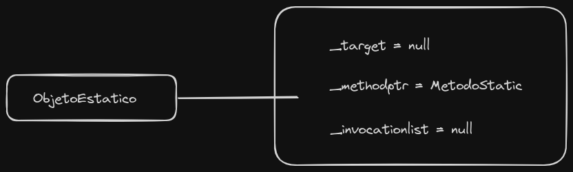
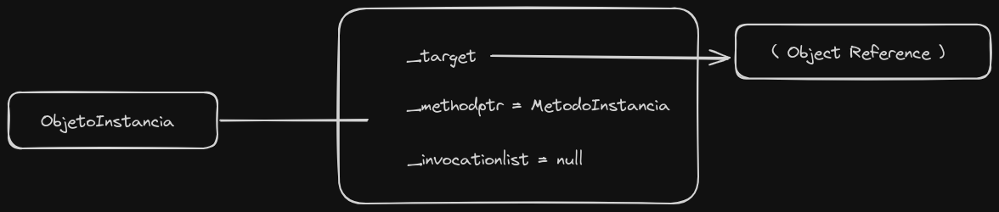

# Delegates nos bastidores

Delegates é bastante comum no cenário .NET. Sendo conhecido como objeto que referência métodos, possuem diversos benefícios como:

1. Encapsulação de métodos
2. Callback
3. Eventos
4. Programação assíncrona
5. Composição de métodos
6. Delegação de responsabilidade

que permite uma programação mais flexível.

Partindo desse ponto, será abordado abaixo como o "Objeto que referência métodos" realmente funciona por "debaixo dos panos" e como o compilador e o CLR trabalham para implementar o delegates.

### Código:

```csharp
public delegate void MeuDelegate(int valor);
```

Ao escrever o código acima, o compilador define uma classe completa a esse exemplo:

```csharp
class MyDelegate : System.MulticastDelegate
{
    public  MeuDelegate(Object object, Inptr method);

    public virtual void Invoke(Int32 valor);

    public virtual IAsyncResult BeginInvoke(Int32 valor, 
			AsyncCallback callback, object object);

    public virtual void EndInvoke(IAsyncResult result);
}
```

E esta classe tem quatro partes principais:

- **Construtor**:
	Utilizado para criar uma instância do delegado, aceitando dois parâmetros: Um objeto e um ponteiro para um método.
	
 - **Método Invoke**
	 Método utilizado para chamar o método associado ao delegado no mesmo thread.

- **Metódo BeginInvoke**
	Método utilizado para chamar o método de forma assíncrona.

- **Método EndInvoke**
	Método utilizado para finalizar uma chamada assíncrona feita com BeginInvoke.

Existem também três campos internos que desvendam como os métodos ( estáticos e de instância ) são apontados, sendo provavelmente a característica mais significativa nos delegates.

- **_target**
	Se o método associado ao delegado é estático, este campo é nulo. Se for um método de instância, ele contém uma referência ao objeto que contém o método.

- **methodptr**
	Este é um número especial que identifica o método associado ao delegado.

- **invocationlist**
	Este campo geralmente é `null` e é usado para armazenar uma lista de delegados, geralmente quando você combina vários delegados em um único delegado.

Aqui um exemplo de como esses campos funcionam com método estático e método de instância.

```csharp
MeuDelegate objetoEstatico = new MeuDelegate(Classe.MetodoStatic);
MeuDelegate objetoInstancia = new MeuDelegate(new Classe().MetodoInstancia);
```



Se você cria um delegado para um método estático, o campo `_target` é nulo e o `_methodptr` aponta para o método estático.



Se for um método de instância, `_target` aponta para o objeto que contém o método e `_methodptr` aponta para o método em si.

O método `.Combine` é usado para combinar vários delegados em um único delegado. Quando você combina delegados, o C# cria um novo objeto delegado para representar a combinação dos delegados originais. 

```csharp
MeuDelegate objetoEstatico = new MeuDelegate(Classe.MetodoStatic);
MeuDelegate objetoInstancia = new MeuDelegate(new Classe().MetodoInstancia);

MeuDelegate objetoListaDeDelegates = null;
objetoListaDeDelegates = (MeuDelegate) Delegate.Combine( objetoListaDeDelegates, objetoEstatico);
objetoListaDeDelegates = (MDelegate) Delegate.Combine( objetoListaDeDelegates, objetoInstancia);
```

No exemplo dado:

- `objetoEstatico` é um delegado que representa um método estático.
- `objetoInstancia` é um delegado que representa um método de instância.
- `objetoListaDeDelegates` é inicialmente nulo, mas depois de combinar os delegados, ele representa um novo delegado que combina os métodos de `objetoEstatico` e `objetoInstancia`.


### Delegates Assíncronos

Os delegates em C# podem chamar métodos de forma assíncrona, o que significa que eles podem iniciar a execução de um método em um thread separado e retornar imediatamente ao thread principal.

Quando você usa o método `BeginInvoke` em um delegate, o CLR coloca a solicitação na fila e retorna ao thread principal. O método de destino será então chamado em um thread do pool de threads, permitindo que o thread principal execute outras tarefas enquanto aguarda a conclusão do método de destino.

O método `BeginInvoke` tem três parâmetros:

1. O primeiro parâmetro é um parâmetro de entrada para o método.
2. O segundo parâmetro é um delegado do tipo `AsyncCallBack`, que é um mecanismo de retorno de chamada que será invocado quando o método de destino for concluído.
3. O terceiro parâmetro é usado para fornecer informações de estado assíncrono.

Se você não especificar um retorno de chamada, o método `EndInvoke` será usado no thread original para obter o valor de retorno do processamento assíncrono. Se um retorno de chamada estiver presente, o método `EndInvoke` será chamado no método de retorno de chamada.

Exemplo de código de um delegate assíncrono:

```csharp
using System;
using System.Threading;

public delegate int MeuDelegado(int valor);

class Program
{
    static void Main(string[] args)
    {
        MinhaClasse minhaClasse = new MinhaClasse();
        MeuDelegado meuDelegado = new MeuDelegado(minhaClasse.MeuMetodo);

        // Inicia o processamento assíncrono
        IAsyncResult resultadoAssincrono = meuDelegado.BeginInvoke(5, new AsyncCallback(MeuCallback), "Informação do estado");

        Console.WriteLine("Do thread principal");

        Console.ReadLine();
    }

    public static void MeuCallback(IAsyncResult resultadoAssincrono)
    {
        AsyncResult resultado = (AsyncResult)resultadoAssincrono;
        MeuDelegado meuDelegado = (MeuDelegado)resultado.AsyncDelegate;
        int resultadoMetodo = meuDelegado.EndInvoke(resultadoAssincrono);
        Console.WriteLine("Resultado do callback: " + resultadoMetodo);

        // Informação do estado do thread principal
        string mensagem = (string)resultadoAssincrono.AsyncState;
        Console.WriteLine(mensagem);
    }
}

class MinhaClasse
{
    public int MeuMetodo(int valor)
    {
        Thread.Sleep(10000);
        return (valor * valor);
    }
}

```

Neste exemplo:

- `MeuDelegado` é um delegado que representa um método que retorna um inteiro e aceita um inteiro como parâmetro.
- `MinhaClasse` contém o método `MeuMetodo`, que será chamado de forma assíncrona.
- O método `BeginInvoke` inicia o processamento assíncrono do método `MeuMetodo`.
- O método `MeuCallback` é chamado quando o método `MeuMetodo` é concluído, exibindo o resultado do callback e a informação de estado do thread principal.

Assumindo que o método `MeuMetodo` retorna o quadrado do valor passado como argumento, o resultado do callback será o quadrado de `5`, ou seja, `25`.

Portanto, a saída seria:

```csharp
Do thread principal
Resultado do callback: 25 
Informação do estado
```

Delegates é um objeto que  se refere a métodos e pode ser usado tanto em processos assíncronos quanto síncronos, permitindo a execução de métodos em outras threads. O uso de processamento assíncrono é especialmente útil para realizar tarefas em segundo plano, sem bloquear o thread principal.

##  Fontes de estudo

- [Advanced C# Delegates like a Senior Developer: Real-World Examples in .NET!](https://www.youtube.com/watch?v=LEcxrLb3OpY)
- [Delegate Behind the Scenes](https://www.codeproject.com/search.aspx?q=Delegate+Behind+the+Scenes&x=0&y=0&sbo=kw)
- [10 Simple Tricks to Understand C# Delegates](https://towardsdev.com/10-simple-tricks-to-understand-c-delegates-f6e09ab8f6c6)
- [Events e delegates | C# Avançado | Notificações, Func, Action, Predicate e Anônimos](https://www.youtube.com/watch?v=SuW2GwO17qA)

## Autores

Estes projetos de exemplo foram criados para fins educacionais. [Marcelo](https://github.com/Mmarcelinho) é responsável pela criação e manutenção destes projetos.

## Licença

Este projetos não possuem uma licença específica e são fornecidos apenas para fins de aprendizado e demonstração.
